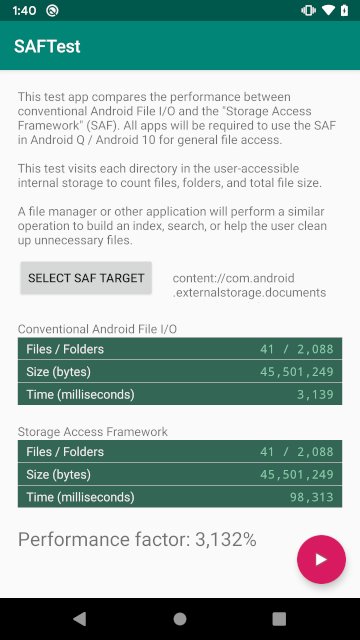

# SAFTest
Android/Java Conventional File API / Storage Access Framework Performance Test
* [Pre-built APK Download](http://android.nextapp.com/project/saftest/release/r1/SAFTest_r1.apk)




This is a test application to evaluate the comparative performance of
conventional Android/Java file operations vs the Android Storage Access
Framework.

This project was created to demonstrate the difference in performance
for file operations now that Android Q/10 will require file explorer
developers to use the Storage Access Framework in lieu of conventional
java.io.File access as was done with Android 1.0-9.0.

Despite being oriented toward testing Android Q/10, This application
will run on any version of Android after 5.0, when Android added support
for the Storage Access Framework.

The test walks the entirety of the user-accessible internal storage
filesystem, i.e. that which is traditionally found at
```Environment.getExternalStorageDirectory()```, commonly mounted at the
path ```/storage/emulated/0``` and aliased to ```/sdcard```.

The test counts the number of files, number of folders, and total size
of all files on the Internal Storage. A file manager app would perform a
similar walk of a directory hierarchy if it were performing a search,
checking for recently updated files, or helping the user find
unnecessary items to clean-up.

This directory-walk test is performed with both conventional Java I/O
(java.io.File operations) and with the Storage Access Framework.

The difference in performance shown by this app is what a user will
observe after upgrading his or her device to Android Q / 10 and using a
file manager which supports Android Q. (File managers which do not
specifically support Q will not have access to the user's files at all.)

## Setup 

* Install the app.
* Run the following adb command on the device to allow it to access all
  files on the device using java.io.File access (on a single line): 
  ```
  adb shell cmd appops set nextapp.saftest android:legacy_storage allow
  ```
* Open the app.
* The app will request file write access permissions (no files are
  actually written).
* Press the "Select SAF Target" button to select the location of the
  device's internal storage.
  - Tap the 3-dots menu (overflow menu) in the upper right corner of the
    screen.
  - If the menu contains an option, "Show internal storage", press it. I
    if it does not, simply continue to the next step.
  - Tap the 3-lines menu (hamburger menu) in the upper left corner of
    the screen.
  - Select the "Internal Storage". It may be named after the device,
    e.g. "Pixel"
  - Press the "Allow Access" button at the bottom of the screen.
  - Press the "Allow" button in the dialog that appears.
* Press the floating "Play" button at the bottom of the app and wait for
  the test to run.
  - The conventional test will run first, followed by the SAF test.
* For the test to be valid, the total folder, file, and byte counts
  should be similar between the two. The time, unfortunately, will not.
* The test will show a "performance factor" as a percentage representing
  how much longer the SAF took to perform the operation relative to
  conventional file access. For example, a value of 3,000% indicates
  SAF was 30 times slower than conventional access.
  
## Troubleshooting

* If you're on Android Q and see very few files/folders show in the
  "Conventional" test, you likely haven't successfully granted legacy
  storage access which is required for this test to run. Try the "adb
  shell" command again and then force close the app (swipe it away with
  Android's task manager) and open it again.

  
